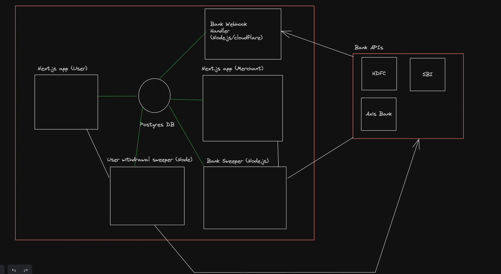

# Paytm

## About the Project

- Paytm is one of the biggest and widely payments wallet in India. This is a project that tries to implement a couple of features from the project.
- I developed a secure token generation for Paytm payment transactions, managing redirection to Bank APIs and ensuring webhook notifications upon successful payments.

## Features

- Users can add money to their wallet from their bank account
- Users can send money back to their bank account from the wallet
- Users can transfer the money from one wallet to another wallet (p2p transfers)

## Concepts

### On Ramping

- It is a concept that allows Paytm to generate a token for a payment for a user for an amount.
- Paytm then redirects the user to bank's page using this token.
- If user made a successful payment, bank hits the webhook url provided by the company.
- Paytm becomes aware about the transaction and updates the balances accordingly.

## Tech Stack

- Mircoservice Archtiecture using Turborepo
- Next.js
- Node.js
- Express.js
- Prisma

## Architecture



- User App
- Merchant App
- Bank APIs
- Bank Webhook
- Bank Sweeper
- User Withdrawl Sweeper
- Database

## Local Development Instructions

```bash
npm run dev
```
